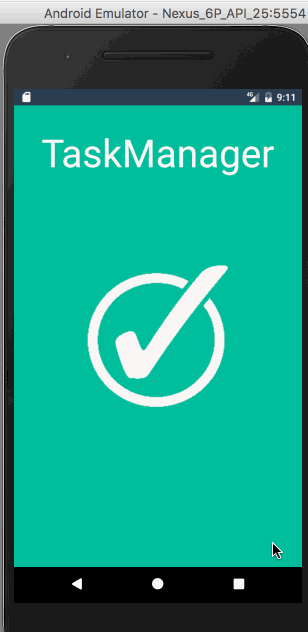

# TasksManager
 Android Todo list application - March Android Bootcamp Remote Application 
 
 # Pre-work - *TasksManager*

**TasksManager** is an android app that allows building a todo list and basic todo items management functionality including adding new items, editing and deleting an existing item.

Submitted by: **Sandy Ludosky**

Time spent: 
+ **35** hours spent in total
+ Extra **10** hours to implement additional features

## User Stories

The following **required** functionality is completed:

* [x] User can **successfully add and remove items** from the todo list
* [x] User can **tap a todo item in the list and bring up an edit screen for the todo item** and then have any changes to the text reflected in the todo list.
* [x] User can **persist todo items** and retrieve them properly on app restart

The following **optional** features are implemented:

* [x] Persist the todo items [into SQLite](http://guides.codepath.com/android/Persisting-Data-to-the-Device#sqlite) instead of a text file
* [x] Improve style of the todo items in the list [using a recycler view](https://guides.codepath.com/android/using-the-recyclerview)
* [x] Add support for completion due dates of todo items:  (and display within listview item) (due today, overdue)
* [x] Add support with RadioGroupButton for selecting the priority level of each todo item (low, medium, high)
* [x] Add support with SpinnerView for selecting status of each todo item (active, done)
* [x] Tweak the style improving the UI / UX, play with colors, images or backgrounds

The following **additional** features are implemented:

* [x] Querying with “ASC” *orderby* to sort tasks by date in listview
* [x] Added Material Design and Floating Action Button library support
* [x] Applying Color coding for priority levels : low, medium and high
* [x] Custom Spinner Style
* [x] Added Launch screen and basic animation

## Video Walkthrough 

Here's a walkthrough of implemented user stories:

GIF created with [LiceCap](http://www.cockos.com/licecap/).

## Notes

Describe any challenges encountered while building the app:

Implementing SQLite Database was a challenge because of the lack of visibility on the data structure. I was not able to get a graphical view of the database records using Android Device Monitor. I felt limited in my ability to debug when things were not working as intended.

Also, I realized that I over complicated the code by adding enum custom data types in my Todo object Class. SQLite accepts data types such as : Text, real, int, none. So, I used helper methods to handle data type conversion back and forth : to save to the database and to fetch from the database. I later refactored the code to include helper methods in one single class and remove code repetitions.
Areas of improvement would be to understand and learn more about best practices of app structure and design patterns, which I think would help in many other areas of programming.

Finally, customizing the spinner, that I use to select a task's status, was not straighforward. Resources from stackoverflow helped a lot. Mobile App design is one area on which I really want to focus and get better at.

